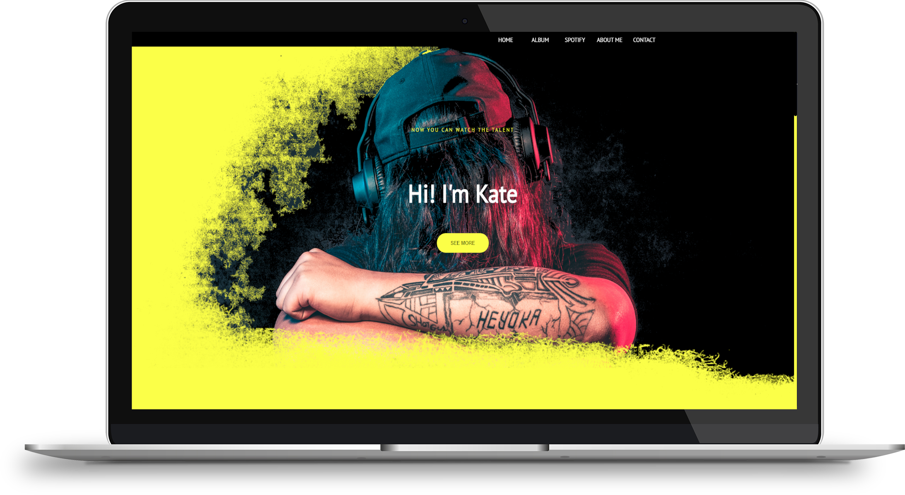
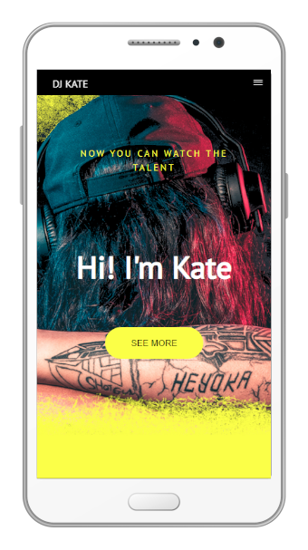

# DJ Kate PORTFOLIO

> Portfolio for DJ Kate

## Contents

- [Technologies](#technologies)
- [Link](#link)
- [Description](#description)
- [View desktop](#view-dekstop)
- [View mobile](#view-mobile)
- [Author](#author)
- [Version](#version)
- [License](#license)

## Technologies

- HTML5 
- CSS3 
- JavaScriptES6

## Link

[Click here](https://davidburdelak.github.io/DJ-Kate-portfolio-Website/)

## Description

Portfolio for professional DJ.

## View desktop

## View mobile

## Author

David Burdelak

## Version

1.0.0

## License

The DJ Kate PORTFOLIO is released under the
[MIT license](https://opensource.org/licenses/MIT).
